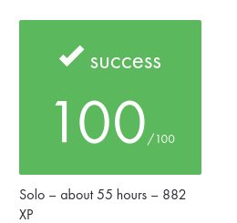

# Academic Project Context

## Project Record

| Field | Value |
| --- | --- |
| Project | `get_next_line` |
| Curriculum | 42 Common Core |
| Supplied subject reference | Version 14.3 |
| Final evaluation | **100/100** |
| Project type | Individual |
| Estimated curriculum workload | About 55 hours |
| Curriculum XP | 882 XP |

## Evaluation

The original 42 project received a final evaluation of **100/100**.

The image is a cropped record of the original 42 Intra evaluation result.
It intentionally excludes evaluator identities, peer comments, internal
repository information, private URLs, navigation elements, and unrelated
platform statistics.

The evaluation evidence records successful completion of the mandatory project.

The original evaluation record indicates that the bonus did not compile.
Accordingly, this portfolio documentation does not claim successful completion
of the optional bonus part.

## Subject Reference

The subject document supplied for this portfolio documentation pass identifies
itself as:

- **Project:** Get Next Line
- **Subtitle:** Reading a line from a file descriptor is way too tedious.
- **Version:** 14.3

The original subject PDF is not redistributed in this public repository.

Version 14.3 is recorded here as the supplied documentary reference. This
repository does not claim that the supplied PDF can independently prove the
exact subject revision present on the original evaluation date.

## Repository History

This repository began as my academic implementation of the 42 Common Core
`get_next_line` project.

The current `main` branch is a maintained portfolio edition. It includes later
professionalization work such as regression testing, compiler validation, CI,
Valgrind validation, Doxygen documentation, maintainability review, and
repository documentation.

The maintained source tree intentionally focuses on the mandatory
single-file-descriptor implementation.

The annotated tag `portfolio-baseline-2026-09` preserves the repository state
immediately before the structured professional portfolio modernization.

The tag `v1.0.0` identifies the first maintained portfolio release. Later
documentation or maintenance may exist on `main` without moving or rewriting
that release tag.

## AI Usage

### Original academic development

AI was used during the original academic project as a learning and testing
support tool.

Its role included:

- helping explain project concepts;
- supporting the design and review of tests;
- helping reason about expected behaviour and edge cases.

The documented academic use of AI was therefore focused on understanding and
validation support rather than treating generated output as a substitute for
understanding the implementation.

### Portfolio modernization

AI was used more extensively later, during the professional modernization of
the repository.

It was used as an engineering assistant for activities including:

- systematic repository and code audits;
- maintainability review;
- regression-test strategy;
- CI and GitHub workflow planning;
- documentation design and review;
- validation planning;
- portfolio-wide consistency work.

AI-assisted suggestions were reviewed against the actual implementation and
validated before integration.

The two phases are documented separately so that later AI-assisted portfolio
work is not conflated with the role AI had during the original academic
project.
